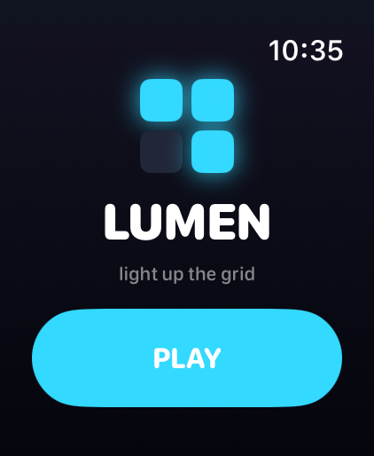
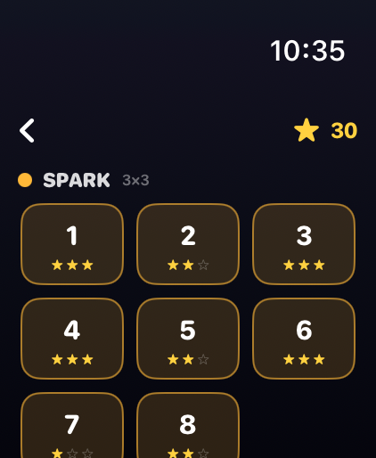
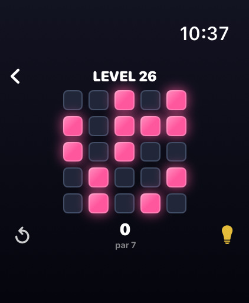
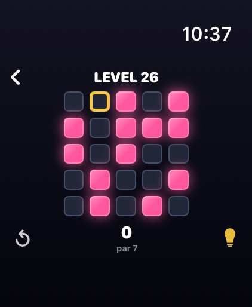
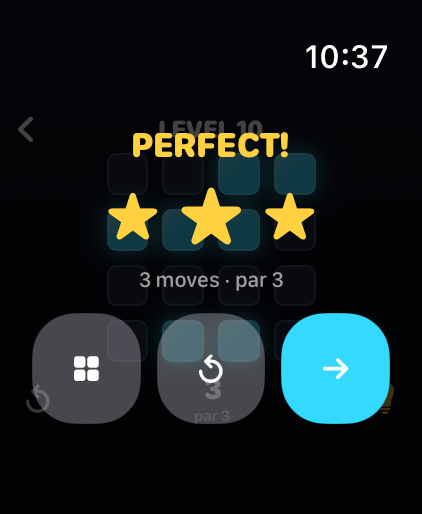

# Lumen ✨

A premium **Lights Out** puzzle game for **Apple Watch** (built for the Watch
Ultra, runs on watchOS 10+). Tap a tile to flip it **and its neighbours** — your
goal is to light up the **entire** grid. **40 hand-tuned levels** across four
worlds, each with an exact optimal "par" so your star ratings actually mean
something.

Written entirely in **SwiftUI**, with a real **GF(2) linear-algebra solver**
that computes every level's provably-minimum solution — which powers both the
3-star scoring and the in-game **hint** button. Glowing animated tiles, a
Crown-scrollable level map, saved progress, and Taptic feedback throughout. No
companion iPhone app required.

## Screenshots

_Captured on the Apple Watch Ultra 3 (49mm) simulator._

| Title | Levels | Puzzle | Hint | Solved |
|:-----:|:------:|:------:|:----:|:------:|
|  |  |  |  |  |

---

## How to play

- Tap any tile. It toggles **itself and the four orthogonally-adjacent tiles**
  between lit and unlit.
- **Win** by lighting up *every* tile on the board.
- Each level has a **par** — the provably-minimum number of taps. Your stars:
  - ⭐⭐⭐ solved in **par** (a perfect),
  - ⭐⭐ within par + 2,
  - ⭐ solved at all.
- Stuck? The 💡 **hint** lights a ring around an optimal next tap (it forfeits
  the 3rd star for that attempt). ↺ resets the level.
- Levels unlock as you clear them; your best stars are saved.

## Worlds & levels

| World | Grid | Levels |
|-------|:----:|:------:|
| **Spark**  | 3×3 | 8 |
| **Glow**   | 4×4 | 12 |
| **Beacon** | 5×5 | 12 |
| **Nova**   | 5×5 (expert) | 8 |

Each world has its own glow colour, and difficulty ramps by par within and
across worlds — **40 levels** in total. Every board is generated deterministically
and **guaranteed solvable**.

---

## Install & run

Requires **Xcode 16+** (developed on Xcode 26.5 / watchOS 26.5 SDK) on a Mac.

```bash
open Lumen.xcodeproj
```

### Run in the Simulator (easiest)

1. Pick any **Apple Watch** simulator in Xcode's destination dropdown
   (e.g. *Apple Watch Ultra 3 (49mm)*). No watch sims listed? Install a runtime
   via **Xcode ▸ Settings ▸ Components ▸ watchOS**.
2. Press **Run** (⌘R) and tap **PLAY**.

### Install on your real Apple Watch ⌚️

Your watch must be paired to your iPhone and unlocked. A **free Apple ID works**
(the app expires after 7 days — just re-run from Xcode); a paid **Apple
Developer Program** membership removes that limit.

1. **Sign in:** *Xcode ▸ Settings ▸ Accounts ▸ +* (your Apple ID).
2. **Signing:** select the **Lumen Watch App** target ▸ *Signing & Capabilities*
   ▸ tick *Automatically manage signing* ▸ choose your **Team**. If the bundle
   ID is taken, change it to e.g. `com.yourname.lumen`.
3. **Developer Mode on the watch** (watchOS 9+): *Settings ▸ Privacy & Security
   ▸ Developer Mode ▸ On*, then let it restart.
4. **Pick your watch** in Xcode's destination dropdown ▸ press **Run** (⌘R).
5. **Trust the developer** the first time: on the watch, *Settings ▸ General ▸
   VPN & Device Management ▸ (your Apple ID) ▸ Trust*, then open **Lumen**.

### Command-line build check

```bash
DEVELOPER_DIR=/Applications/Xcode.app/Contents/Developer \
xcodebuild -project Lumen.xcodeproj -scheme "Lumen Watch App" \
  -sdk watchsimulator26.5 -destination 'generic/platform=watchOS Simulator' \
  CODE_SIGNING_ALLOWED=NO build
```

---

## How it works (the fun part)

Lights Out is linear algebra over **GF(2)** (arithmetic mod 2). Each cell gives
one equation: *the sum of the taps touching it must equal whether it needs to
flip*. `Solver.swift` reduces that system to **reduced row-echelon form**, then
enumerates the **null space** to find the **minimum-weight** tap set — the true
optimal solution. That single routine gives us three things for free:

- **par** for every level (used for star scoring),
- **hints** (recompute the optimal solution for the *current* board, reveal one tap),
- **guaranteed-solvable level generation** (scramble the solved board, then keep
  boards whose computed par matches the target difficulty).

The solver is unit-tested separately (`/tmp` harness during development): 30
generated boards across 3×3/4×4/5×5 all verified solvable with exact par.

## Project layout

```
Lumen/
├─ Lumen.xcodeproj
├─ Screenshots/
└─ LumenWatchApp/
   ├─ LumenApp.swift        # @main entry, owns the LumenGame
   ├─ ContentView.swift     # phase router (title / levels / playing)
   ├─ TitleView.swift       # title screen + total stars
   ├─ LevelSelectView.swift # Crown-scrollable world/level map with stars
   ├─ GameView.swift        # the board, HUD, reset/hint, win overlay
   ├─ LumenGame.swift       # state, scoring, unlocks, persistence
   ├─ Solver.swift          # GF(2) solver + solvable level generation
   ├─ Models.swift          # Level/World, seeded RNG, bit helpers
   ├─ Theme.swift           # per-world palette + logo glyph
   ├─ Haptics.swift         # Taptic Engine wrapper
   └─ Assets.xcassets       # app icon + accent colour
```

## Tuning

World definitions and per-level par schedules live at the top of
**`LumenGame.swift`** — add worlds, change grid sizes, or retune difficulty
there. Colours and glow are in **`Theme.swift`**.
